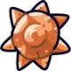
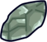
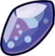
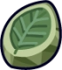
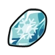
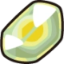
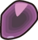
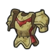
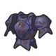
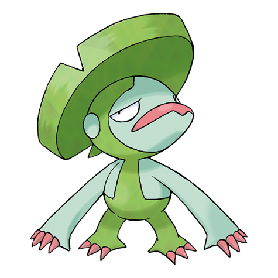

# Evolutions and Forms


is site is an early **work in progress**. Many pages may be missing or incomplete. Please let us know at [discord.gg/poketwo](https://discord.gg/poketwo) if you would like to help write or improve a page.


### Contents

1. [#list-of-related-commands](evolutions-and-forms.md#list-of-related-commands "mention")
2. [#introduction](evolutions-and-forms.md#introduction "mention")
3. [#evolution-by-leveling-up](evolutions-and-forms.md#evolution-by-leveling-up "mention")
4. [#preventing-xp-gain](evolutions-and-forms.md#preventing-xp-gain "mention")
   1. [#xp-blocker](evolutions-and-forms.md#xp-blocker "mention")
5. [#preventing-evolution](evolutions-and-forms.md#preventing-evolution "mention")
   1. [#everstone](evolutions-and-forms.md#everstone "mention")
6. [#pokemon-evolves-somehow](evolutions-and-forms.md#pokemon-evolves-somehow "mention")
7. [#evolution-based-on-time](evolutions-and-forms.md#evolution-based-on-time "mention")
8. [#evolution-by-trading](evolutions-and-forms.md#evolution-by-trading "mention")
9. [#evolution-while-holding-an-item](evolutions-and-forms.md#evolution-while-holding-an-item "mention")

List of Evolution Items

1. [Friendship Bracelet](evolutions-and-forms.md#friendship-bracelet)
2. [ Sun Stone](evolutions-and-forms.md#sun-stone)
3. [ Moon Stone](evolutions-and-forms.md#moon-stone)
4. [ Fire Stone](evolutions-and-forms.md#fire-stone)
5. [ Thunder Stone](evolutions-and-forms.md#thunder-stone)
6. [ Water Stone](evolutions-and-forms.md#water-stone)
7. [ Leaf Stone](evolutions-and-forms.md#leaf-stone)
8. [Ice Stone](evolutions-and-forms.md#ice-stone)
9. [ Shiny Stone](evolutions-and-forms.md#shiny-stone)
10. [ Dusk Stone](evolutions-and-forms.md#dusk-stone)
11. [ Dawn Stone](evolutions-and-forms.md#dawn-stone)
12. [ Oval Stone](evolutions-and-forms.md#oval-stone)
13. [ Auspicious Armor](evolutions-and-forms.md#auspicious-armor)
14. [ Malicious Armor](evolutions-and-forms.md#malicious-armor)
15. [ King's Rock](evolutions-and-forms.md#kings-rock)
16. [ Deep Sea Tooth](evolutions-and-forms.md#deep-sea-tooth)
17. [ Deep Sea Scale](evolutions-and-forms.md#deep-sea-scale)
18. [ Metal Coat](evolutions-and-forms.md#metal-coat)
19. [ Dragon Scale](evolutions-and-forms.md#dragon-scale)
20. [ Upgrade](evolutions-and-forms.md#upgrade)
21. [ Protector](evolutions-and-forms.md#protector)
22. [ Electirizer](evolutions-and-forms.md#electirizer)
23. [ Magmarizer](evolutions-and-forms.md#magmarizer)
24. [ Dubious Disc](evolutions-and-forms.md#dubious-disc)
25. [ Reaper Cloth](evolutions-and-forms.md#reaper-cloth)
26. [ Razor Claw](evolutions-and-forms.md#razor-claw)
27. [ Razor Fang](evolutions-and-forms.md#razor-fang)
28. [ Prism Scale](evolutions-and-forms.md#prism-scale)
29. [ Whipped Dream](evolutions-and-forms.md#whipped-dream)
30. [ Sachet](evolutions-and-forms.md#sachet)

9. [#form-change-items](evolutions-and-forms.md#form-change-items "mention")

List of Form Change Items

1.  Griseous Orb
2.  Gracidea
3.  Reveal Glass
4.  Prison Bottle
5.  Red Nectar
6.  Yellow Nectar
7.  Pink Nectar
8.  Purple Nectar

10. [#mega-evolutions](evolutions-and-forms.md#mega-evolutions "mention")

### List of Related Commands

1. `@​Pokétwo#8236 pokedex <pokémon-name>` - To view information about a pokémon, including its evolution information.
2. `@​Pokétwo#8236 shop <page-number>` - To view items in the shop.
3. `@​Pokétwo#8236 select <pokémon-id>` - To select a pokémon
4. `@​Pokétwo#8236 buy <item-name>` - To buy an item from the shop.
5. `@​Pokétwo#8236 moveitem <from-pokémon-id> <to-pokémon-id>` - To move a held-item from one pokémon to another.
6. `@​Pokétwo#8236 dropitem` - To permanently remove the held item of the selected pokémon.
7. `@​Pokétwo#8236 time` - To view the current time in a server.
8. `@​Pokétwo#8236 location <location>` - To change the location (and time) of a server.
9. `@​Pokétwo#8236 trade @user` - To perform trades with other users.
10. `@​Pokétwo#8236 unmega` - To permanently un-mega a mega pokémon (no refund).

### Introduction

To see how a pokémon evolves, run the command `@​Pokétwo#8236 pokedex <pokémon-name>` and it will show the evolution method under the **Evolution** heading.

.png>)

However, some of these evolution descriptions can be confusing. You can find the details about all methods of evolution on this page.

### Evolution by Leveling Up

Most pokémon evolve by leveling up to a certain level.

Whenever you send messages (with an interval of **1.5 seconds**), your [selected pokémon](viewing-your-pokemon.md#selecting-pokemon) will gain a random amount of XP between **10** and **40**. Commands do not count.

When your selected pokémon reaches the XP requirement, it will level up to the next level, resetting the XP and increasing the XP requirement by **25**. The XP requirement starts from **275** (at level 1) and ends at **2750** (at level 100).

These items will help with pokémon that evolve via leveling up:

* **Rare Candies** - **75 pokécoins** - Instantly levels your selected pokémon up by **1**
* **XP Booster 0** - **20 pokécoins** - Doubles the XP gain for **30 minutes**
* **XP Booster 1** - **40 pokécoins** - Doubles the XP gain for **1 hour**
* **XP Booster 2** - **70 pokécoins** - Doubles the XP gain for **2 hours**&#x20;
* **XP Booster 3** - **100 pokécoins** - Doubles the XP gain for **3 hours**

XP boosters are recommended over Rare Candies, they cost much less and provide much more if you have the patience.

### Preventing XP Gain

For pokémon that have collection value such as shinies and event pokémon, their level and XP have an effect on the value. In such a situation, you can buy an **XP blocker** to prevent XP gain (and leveling) on that pokémon.

#### XP Blocker

`@​Pokétwo#8236 buy xp blocker`

Price: **150 pokécoins**

An XP Blocker will prevent a pokémon from gaining any XP (from messages) and hence stop its leveling.

### Preventing Evolution

Sometimes there might be a need to prevent a pokémon from evolving. This can be because you are collecting the pokémon or other reasons. In such a case, you can buy an **Everstone** to disable the evolution of a pokémon.

####  Everstone

`@​Pokétwo#8236 buy everstone`

Price: **150 pokécoins**

An Everstone will disable evolution for a pokémon while it is holding one. It can be unequipped by using `@​Pokétwo#8236 moveitem <from-pokémon-id> <to-pokémon-id>` to move to another pokémon, or removed permanently using `@​Pokétwo#8236 dropitem`.

### Pokémon Evolves "somehow"

Some pokémon's pokedex entry may say that they "evolve **somehow"**. This unfortunately means that the evolution of this pokémon is currently not implemented into the bot, and hence cannot be obtained through evolution. Instead, you will have to rely on other sources such as the market and catching to obtain such a pokémon.

Their evolution is planned and will be implemented in a future update.

### Evolution Based on Time

Some pokémon evolve when leveled up at particular times; daytime or nighttime. Each server can have its own location, which will have its real-life time. The default is **San Francisco, USA**, the timezone of which is **PST (GMT-8)**.

`@​Pokétwo#8236 time` - Command to check the current time of the server

`@​Pokétwo#8236 location <real-life location with desired time>` - Command to change the location of the server, which will change the time of the server to that of the location.

### Evolution by Trading

Some pokémon need to be traded in order to evolve.

Steps to perform such an evolution:

1. Start a trade with another user or alt account (recommended) using `@​Pokétwo#8236 trade @user`.
2. Add the pokémon to the trade using `@​Pokétwo#8236 trade add <pokémon-ids>` or by bulk using `@​Pokétwo#8236 trade addall <filters>`. E.g. `@​Pokétwo#8236 trade addall --name Pumpkaboo`.
3. Confirm the trade (both users) using `@​Pokétwo#8236 trade confirm`.
4. The pokémon will now evolve one by one.\
   


Be careful when trading pokémon that evolve via trading. To prevent them from evolving, buy [**Everstone(s)**](evolutions-and-forms.md#everstone) for them.


### Evolution While Holding An Item

Some pokémon need to be given a particular item to evolve.

Select the pokémon you want to buy an item for (`@​Pokétwo#8236 select <pokémon-id>`) and run the buy command (`@​Pokétwo#8236 buy <item-name>`) for the respective item. After that, follow the instructions in the pokémon's pokedex entry to evolve it (e.g. some need to be leveled up, some may need to be traded, etc).

Listed below are the different items and the pokémon that need them to evolve. These items can be found on the shop pages 2 and 4 (`@​Pokétwo#8236 shop <page-number>`).&#x20;

They all cost **150 pokécoins**.

#### Friendship Bracelet

`@​Pokétwo#8236 buy friendship bracelet`

In the official pokémon games, some pokémon need a certain level of friendship status to evolve. This friendship system is not a part of Pokétwo. Instead, those pokémon now evolve by leveling up while holding this item, the **friendship bracelet**. Listed below are the pokémon that evolve using this item.

List of Pokémon

*  Pichu -->  Pikachu
*  Cleffa -->  Clefairy
*  Igglybuff -->  Jigglypuff
*  Golbat -->  Crobat
*  Meowth -->  Persian
*  Chansey -->  Blissey
*  Eevee -->  Espeon [_\[Daytime\]_](evolutions-and-forms.md#evolution-based-on-time)
*  Eevee -->  Umbreon [_\[Nighttime\]_](evolutions-and-forms.md#evolution-based-on-time)
*  Munchlax -->  Snorlax
*  Togepi -->  Togetic
*  Azurill -->  Marill
*  Budew -->  Roselia [_\[Daytime\]_](evolutions-and-forms.md#evolution-based-on-time)
*  Chingling -->  Chimecho [_\[Nighttime\]_](evolutions-and-forms.md#evolution-based-on-time)
*  Buneary -->  Lopunny
*  Riolu -->  Lucario [_\[Daytime\]_](evolutions-and-forms.md#evolution-based-on-time)
*  Woobat -->  Swoobat
*  Swadloon -->  Leavanny
*  Type: Null -->  Silvally
*  Snom -->  Frosmoth [_\[Nighttime\]_](evolutions-and-forms.md#evolution-based-on-time)

####  **Sun Stone**

`@​Pokétwo#8236 buy sun stone`

*  Gloom -->  Bellossom
*  Sunkern -->  Sunflora
*  Cottonee -->  Whimsicott
*  Petilil -->  Lilligant
* &#x20; Helioptile -->  Heliolisk

####  Moon Stone

`@​Pokétwo#8236 buy moon stone`

*  Nidorina -->  Nidoqueen
*  Nidorino -->  Nidoking
*  Clefairy -->  Clefable
*  Jigglypuff -->  Wigglytuff
*  Skitty -->  Delcatty
*  Munna -->  Musharna

####  Fire Stone

`@​Pokétwo#8236 buy fire stone`

*  Vulpix -->  Ninetales
*  Growlithe -->  Arcanine
*  Pansear -->  Simisear
*  Eevee -->  Flareon

####  Thunder Stone

`@​Pokétwo#8236 buy thunder stone`

*  Pikachu -->  Raichu
*  Eevee -->  Jolteon
*  Eelektrik -->  Eelektross&#x20;

####  Water Stone

`@​Pokétwo#8236 buy water stone`

*  Poliwhirl -->  Poliwrath
*  Shellder -->  Cloyster
*  Staryu -->  Starmie
*  Eevee -->  Vaporeon
*  Lombre -->  Ludicolo
*  Panpour -->  Simipour

####  Leaf Stone

`@​Pokétwo#8236 buy leaf stone`

*  Eevee -->  Leafeon
*  Gloom -->  Vileplume
*  Weepinbell -->  Victreebel
*  Exeggcute -->  Exeggutor
*  Nuzleaf -->  Shiftry
*  Pansage -->  Simisage

#### Ice Stone

`@​Pokétwo#8236 buy ice stone`

*  Eevee -->  Glaceon
*  Alolan Vulpix -->  Alolan Ninetales
*  Alolan Sandshrew -->  Alolan Sandslash
*  Cetoddle -->  Cetitan

####  Shiny Stone

`@​Pokétwo#8236 buy shiny stone`


Shiny Stone does not turn your pokémon shiny! It is an evolution item.


*  Togetic -->  Togekiss
*  Roselia -->  Roserade
*  Minccino -->  Cinccino
*  Floette -->  Florges

####  Dusk Stone

`@​Pokétwo#8236 buy dusk stone`

*  Murkrow -->  Honchkrow
*  Misdreavus -->  Mismagius
*  Lampent -->  Chandelure
*  Doublade -->  Aegislash

####  Dawn Stone

`@​Pokétwo#8236 buy dawn stone`

*  Kirlia -->  Gallade
*  Snorunt -->  Froslass

####  Auspicious Armor

`@​Pokétwo#8236 buy auspicious armor`

*  Charcadet -->  Armarouge

####  Malicious Armor

`@​Pokétwo#8236 buy malicious armor`

*  Charcadet -->  Ceruledge

####  Oval Stone

`@​Pokétwo#8236 buy oval stone`

*  Happiny -->  Chansey _\[Level up during Daytime]_

####  King's Rock

`@​Pokétwo#8236 buy king's rock`

*  Poliwhirl -->  Politoed _\[Trade]_
*  Slowpoke -->  Slowking _\[Trade]_

####  Deep Sea Tooth

`@​Pokétwo#8236 buy deep sea tooth`

*  Clamperl -->  Huntail _\[Trade]_

####  Deep Sea Scale

`@​Pokétwo#8236 buy deep sea scale`

*  Clamperl -->  Gorebyss _\[Trade]_

####  Metal Coat

`@​Pokétwo#8236 buy metal coat`

*  Onix -->  Steelix _\[Trade]_
*  Scyther -->  Scizor _\[Trade]_

####  Dragon Scale

`@​Pokétwo#8236 buy dragon scale`

*  Seadra -->  Kingdra _\[Trade]_

####  Upgrade

`@​Pokétwo#8236 buy upgrade`

*  Porygon -->  Porygon2 _\[Trade]_

####  Protector

`@​Pokétwo#8236 buy protector`

*  Rhydon -->  Rhyperior _\[Trade]_

####  Electirizer

`@​Pokétwo#8236 buy electirizer`

*  Electabuzz -->  Electivire _\[Trade]_

####  Magmarizer

`@​Pokétwo#8236 buy magmarizer`

*  Magmar -->  Magmortar _\[Trade]_

####  Dubious Disc

`@​Pokétwo#8236 buy dubious disc`

* &#x20; Porygon2 -->  Porygon-Z _\[Trade]_

####  Reaper Cloth

`@​Pokétwo#8236 buy reaper cloth`

*  Dusclops -->  Dusknoir _\[Trade]_

####  Razor Claw

`@​Pokétwo#8236 buy razor claw`

*  Sneasel -->  Weavile _\[Level up during Nighttime]_

####  Razor Fang

`@​Pokétwo#8236 buy razor fang`

*  Gligar -->  Gliscor _\[Nighttime]_

####  Prism Scale

`@​Pokétwo#8236 buy prism scale`

In the official games, Feebas evolves to Milotic when leveled up while holding this item. However, this is not the case in Pokétwo and instead, Feebas evolves by just leveling up, making this item completely useless.

####  Whipped Dream

`@​Pokétwo#8236 buy whipped dream`

*  Swirlix -->  Slurpuff _\[Trade]_

####  Sachet

`@​Pokétwo#8236 buy sachet`

*  Spritzee -->  Aromatisse _\[Trade]_&#x20;

### Form Change Items

Similarly to [#evolution-while-holding-an-item](evolutions-and-forms.md#evolution-while-holding-an-item "mention"), some pokémon transform into their forms when given certain items, available for purchase on page 3 of the shop.

Select the pokémon you want to buy an item for (`@​Pokétwo#8236 select <pokémon-id>`) and run the buy command (`@​Pokétwo#8236 buy <item-name>`) for the respective item.

They all cost **150 pokécoins**


Once transformed into its form, a pokémon cannot be transformed back into its base form.


####  Griseous Orb

`@​Pokétwo#8236 buy griseous orb`

*  Giratina -->  Origin Giratina

####  Gracidea

`@​Pokétwo#8236 buy gracidea`

*  Shaymin -->  Sky Shaymin

####  Reveal Glass

`@​Pokétwo#8236 buy reveal glass`

*  Thundurus -->  Therian Thundurus
*  Landorus -->  Therian Landorus
*  Tornadus -->  Therian Tornadus
*  Enamorus -->  Therian Enamorus

####  Prison Bottle

`@​Pokétwo#8236 buy prison bottle`

*  Hoopa -->  Hoopa Unbound

####  Red Nectar

`@​Pokétwo#8236 buy red nectar`

*  Oricorio (any style) -->  Balie Oricorio

####  Yellow Nectar

`@​Pokétwo#8236 buy yellow nectar`

*  Oricorio (any style) -->  Pom-Pom Oricorio

####  Pink Nectar

`@​Pokétwo#8236 buy pink nectar`

*  Oricorio (any style) -->  Pa'u Oricorio

####  Purple Nectar

`@​Pokétwo#8236 buy purple nectar`

*  Oricorio (any style) -->  Sensu Oricorio

### Mega Evolutions

When a Pokémon undergoes Mega Evolution, its base stats change, except for its HP, and it may even acquire a different type than before. It's worth noting that every Mega-Evolved Pokémon possesses a base stat total that is 100 points higher than its unevolved form.

In Pokétwo, eligible pokémon can be Mega Evolved by buying a Mega Evolution from the shop (page 6). using the command `@​Pokétwo#8236 buy <item-name>`.

3 types of Mega Evolutions can be purchased from the shop. They all cost **1000 pokécoins**.


Mega Evolutions do not have a time limit, like in official games, and will stay Mega-Evolved indefinitely. They will only transform back to their base form by using the command `@​Pokétwo#8236 unmega`. Note that this command will not refund the 1000 pokécoins.



In Pokétwo, Kyogre and Groudon attain their Primal forms via [#mega-evolution](evolutions-and-forms.md#mega-evolution "mention").


#### Mega Evolution

`@​Pokétwo#8236 buy mega evolution`

Used to mega evolve pokémon to their generic Mega Evolution.

List of Pokémon

*  Venusaur -->  Mega Venusaur
*  Blastoise -->  Mega Blastoise
*  Beedrill -->  Mega Beedrill
*  Pidgeot -->  Mega Pidgeot
*  Alakazam -->  Mega Alakazam
*  Slowbro -->  Mega Slowbro
*  Gengar -->  Mega Gengar
*  Kangaskhan -->  Mega Kangaskhan
*  Pinsir -->  Mega Pinsir
*  Gyarados -->  Mega Gyarados
*  Aerodactyl -->  Mega Aerodactyl
*  Ampharos -->  Mega Ampharos
*  Steelix -->  Mega Steelix
*  Scizor -->  Mega Scizor
*  Heracross -->  Mega Heracross
*  Houndoom -->  Mega Houndoom
*  Tyranitar -->  Mega Tyranitar
*  Sceptile -->  Mega Sceptile
*  Blaziken -->  Mega Blaziken
*  Swampert -->  Mega Swampert
*  Gardevoir -->  Mega Gardevoir
*  Sableye -->  Mega Sableye
*  Mawile -->  Mega Mawile
*  Aggron -->  Mega Aggron
*  Medicham -->  Mega Medicham
*  Manectric -->  Mega Manectric
*  Sharpedo -->  Mega Sharpedo
*  Camerupt -->  Mega Camerupt
*  Altaria -->  Mega Altaria
*  Banette -->  Mega Banette
* &#x20; Absol -->  Mega Absol
*  Glalie -->  Mega Glalie
*  Salamence -->  Mega Salamence
*  Metagross -->  Mega Metagross
*  Latias -->  Mega Latias
*  Latios -->  Mega Latios
*  Kyogre -->  Primal Kyogre
*  Groudon -->  Primal Groudon
*  Rayquaza -->  Mega Rayquaza
*  Lopunny -->  Mega Lopunny
*  Garchomp -->  Mega Garchomp
*  Lucario -->  Mega Lucario
*  Abomasnow -->  Mega Abomasnow
*  Gallade -->  Mega Gallade
*  Audino -->  Mega Audino
*  Diancie -->  Mega Diancie

#### X Mega Evolution

`@​Pokétwo#8236 buy x mega evolution`

Used to mega evolve eligible pokémon to their X Mega Evolution.

List of Pokémon

*  Charizard -->  Mega Charizard X
*  Mewtwo -->  Mega Mewtwo X

#### Y Mega Evolution

`@​Pokétwo#8236 buy y mega evolution`

Used to mega evolve eligible pokémon to their Y Mega Evolution.

List of Pokémon

*  Charizard -->  Mega Charizard Y
*  Mewtwo -->  Mega Mewtwo Y

