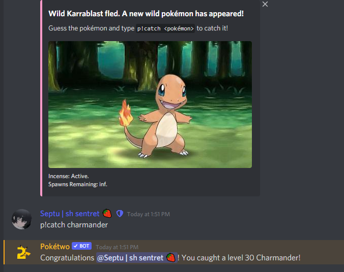
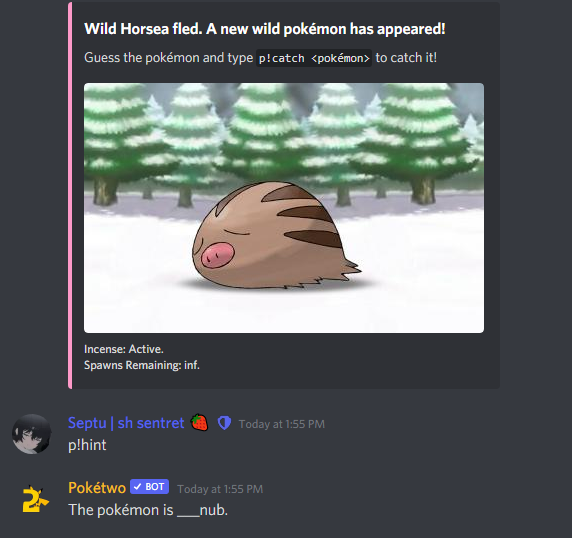

# Spawning & Catching


This site is an early **work in progress**. Many pages may be missing or incomplete. Please let us know at [discord.gg/poketwo](https://discord.gg/poketwo) if you would like to help write or improve a page.


### Spawning Pokémon

The best way to make the bot spawn Pokémon in your server is activity; having an actual conversation will make Pokémon spawn eventually.&#x20;

### Catching Pokémon

First of all, you have to guess what's the name of the wild Pokémon you are gonna catch. After you did so: The command is '\<prefix>catch|c \<guess>'

The bot can have different prefixes in each server. If you don't know the prefix of the server where you are, you can always mention the bot to run the 'catch' command. For an example, if the prefix is 'p!':

You can also get **badges** in your profile ('\<prefix>profile' command) for just catching Pokémon! Check it out **in** [quests.md](../intermediate-topics/quests.md "mention").

### Guessing Pokémon

If you don't know a Pokémon's name, or you just don't remember how it was called, you can receive hints to guess it.

To receive hints of a Pokémon's name, the command is '\<prefix>hint|h'. This will show a few letters of the Pokémon's name, which can help you guessing the name.

For an example:

### Shiny Hunts

For the first, let us tell you that shinies **doesn't spawn;**\
Whenever you catch a Pokémon, you have a very small chance of it to be shiny; shiny hunts make it so that chance gets a little bit bigger each time you catch that Pokémon, and your chain increase every time you do so.

However, the command to shiny hunt a Pokémon is 'sh|shinyhunt \<pokémon-name>'

**Note**: You can't shiny hunt event Pokémon or a Pokémon's form (For example, alolan or galarian). But you can shiny hunt the normal form and only catch the form you want.

As an example, let's say you want to shiny hunt **Galarian Ponyta**.

'\<prefix>sh|shinyhunt **Ponyta**'\
And then you only catch the **Galarian** form of **Ponyta**. It makes it so you have more chances to get a shiny of that Ponyta's form every time you increase the chain.

#### **"Can I catch a shiny that is not my hunt even if I'm hunting a Pokémon?"**

Yes you do! You can always catch a shiny, even if you're not hunting it there's a small chance of getting one.&#x20;

You will know you caught a shiny because the bot will add "These colors seem unusual..." in the catch message.

### Catching Shiny Pokémon

"I've caught a lot more than my friend, though they have caught 3 shinies and I still didn't get a shiny as well. Is there any limit when you're sure that you're going to catch a Shiny Pokémon?"

No, there's not any catches limit to catch a shiny. It depends on your luck.&#x20;

There isn't any limit for the shiny hunts as well, though every time you increase your shiny chain it makes it so you have a higher probability of catching that shiny Pokémon.&#x20;

### Alt Pokémon names

Pokémon have alt names, that means that you can catch them in different languages, though only the ones that are mentioned in the Pokétwo dex.

Here is an example of the alt names of Charmander, which can be found doing the command '\<prefix>dex **Charmander**':&#x20;

So you could type **p!catch ヒトカゲ/Hitokage/Charmander/Glumanda/Salamèche** to catch a Charmander.&#x20;

### Incense

#### **"I want to catch Pokémon in my server but it's not so active, or I just wanna have a good time catching alone in my private server, how can I make Pokémon spawn without activity?"**

Incenses are a thing, of course, and they cost **50** shards each, a total of **10.000 Pokécoins**. You can buy shards with the command '\<prefix>buy shard|shards 50' (The cost is 200 Pokécoins each shard).

They have 180 spawns. Each Pokémon spawns every 20 seconds, which makes it so it is one hour long. To buy an incense you have to run the command '\<prefix>buy incense'.

You can do more than one incense at once, but in different channels. **You can't stack incenses.**

One requirement for buying an incense is having **Administrator** role or being the **Owner** of the server, otherwise you can't buy one.

In case you want to stop your incense, you need the permissions mentioned before and execute the command '\<prefix>stopincense', then confirm.

### Shiny Charm

If you would like to have higher probabilities of catching a Shiny Pokémon, we are here to show you something that will help you with that:

If you execute the command '\<prefix>shop 7' you will see that there is a thing called **Shiny Charm**.

It costs **150** shards, a total of **30.000 Pokécoins** and it's 1 week long, it will increase your probabilities to get a shiny whenever you catch a Pokémon for that time. It works either for your hunt or for catching in general. **Shiny charms can't be stacked.**&#x20;

**Note**: You don't have enough Pokécoins to buy an Incense or Shiny Charm and want to know how to earn Pokécoins being a new player? You can see how to in [Broken link](broken-reference "mention") or [quests.md](../intermediate-topics/quests.md "mention").

### Setting spawn channels

With the '\<prefix>redirect \<channel>' command you can select those channels where you want Pokémon to spawn naturally (Spawns are based on activity, as we explained before). It will make it so Pokémon spawn randomly in each channel (Not in the channel's order).

With the command '\<prefix>redirect reset' you can reset the spawn channels.

You have to get **Administrator** permissions to run the command mentioned before, though not for the next one:\
&#x20;You can run the '\<prefix>config|configuration' command to see which channels are set to spawn Pokémon + The bot prefix and other stuff.

### Catching pings

You can always run the command '\<prefix>togglemention' to turn on/off the catching pings.

\

Note:

**Autospamming** is against discord ToS.&#x20;

**Autocatching** is against Pokétwo ToS and you can get permanently suspended from using the bot in consecuense of using autocatch.
