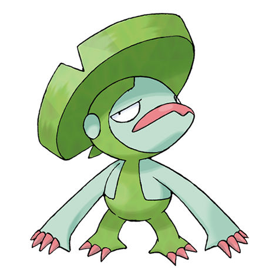

# Events


This site is an early **work in progress**. Many pages may be missing or incomplete. Please let us know at [discord.gg/poketwo](https://discord.gg/poketwo) if you would like to help write or improve a page.


To help engage the community and keep spirits high, we've created events! These events happen throughout the year, celebrating holidays such as Christmas and Halloween. And what's better is that anyone can join in to help! _(More info on helping with events at the very bottom of the page)._

Events in Pokétwo are times of the year where (primarily) our Art Team create different-looking Pokémon for the community to have fun obtaining. There are multiple types of events, so that they're not all the same, and it brings something exciting for the community to look forward to! Everyone involved in the creation of events keep it secret, so that it's a surprise when everyone finds out about it!&#x20;

Events typically last for 1-2 weeks to ensure everyone gets enough time to join in, and can range in rewards depending on what sort of event it is.&#x20;

Different types of events include:

**-Box Events-**

These events will entail the community catching as many Pokémon as they can to receive as many rewards as possible. In these events, different boxes will be dropped, such as the one below, which can be opened by the user whenever they please. Usually, we give another few days after the event has ended for users to open their boxes, however if the user does not open their boxes in the time given, they will be lost.

 (1).png>) .png>)

**-Spawn Events-**

These events mean that the community have to catch as many Pokémon as they can to ensure they collect each of the special pokemon from that event.

**-The Halloween Event, 2020-**\
****\
****This event involved quests, the only event so far which has been this way. The community had to complete a set of quests to earn candies, which could be traded in for multiple things. With enough candies, you could pick from Halloween crate boxes, embeds, and Shadow Lugia (which also spawned very rarely normally). A badge was awarded to those who completed every quest.

 (1).png>)

 (1).png>)

 (1).png>)

**-What are 'Embeds' exactly?-**

To answer simply, an embed is the different colored bar on the left side of Pokémon. The default embed color is blue, this can be seen whenever a regular pokemon is shown using **p!info**. However, buying an 'embed color' with candies allowed the community to customise this color to their desire. This was an item that could've been purchased during the Halloween event, 2020. \
You can use embed colors and change them (if you have one) using **p!embedcolor \<Pokémon ID> <#hex color>**. The 'embedcolor' part in the command can be shortened to 'ec'. So, for example, you can write **p!ec 23 #f34e06.**\
_(For more information on how to use embed colors if you have one, go_ [_here_](search-filters.md)_)._

 (1).png>)

 (1).png>)

**-The Very First Event-**

This event was released before Pokétwo started getting popular. The event was an invite event where the community at that time had to invite as many people as possible to the Pokétwo Offical Server to earn the best rewards possible. Not expecting the bot to grow so much, there were only 10 Ash's Greninjas handed out, and some Costume Pikachus. Now the bot has grown, all of these Pokémon are extremely rare and worth millions of Pokécoins as they are so hard to find. None of these Pokémon spawn normally.&#x20;

 (1).png>)

**-April Fools Day, 2020-**

To many of the community, this was the most fun and hilarious event we've had yet. We invited random (but trusted) members of the community to get together and form a group of artists, no matter if they had experience or not, to redraw every single catchable Pokémon in the Pokédex. Over the course of 2 days we managed to recreate them all, and release them to the rest of the community, changing every single Pokémon spawn. Of course, all of these new versions of Pokémon ranged in style. All of the artists who contributed earned a designated green role in Pokétwo Official Server.

 (1).png>)

 (1).png>)

 (1).png>)

**-Médecins Sans Frontières / Doctors Without Borders Fundraiser Event-**

This event, as the name suggests, was a fundraiser for the Doctors Without Borders charity. The Pokémon for this event was United Pikachu. Pokétwo's overall donation goal was $10,000. Staggeringly, this goal was met just one day after the event was released. There were different smaller goals within the big goal that opened up different rewards for everyone who donated, these included Pokécoins and an increasing amount of Shiny United Pikachus (randomly given away). Everyone who donated $15 or more was awarded with one United Pikachu. At the end of the event, every donor was awarded a special badge to commemorate. In the end, we all managed to raise over $35,000, over 3 times our original goal, it goes without saying we were totally mindblown by the generosity of the community! _(For more info on MSF, go to_ [_https://www.msf.org/_](https://www.msf.org/)_)._

 (1).png>)

_**-Every individual event, and their Pokémon-**_

**Summer event 2020:**\
Ash's greninja\
Pikachu Belle\
Pikachu Libre\
Pikachu Rockstar\
Pikachu PH.D\
\
**Halloween event 2020:**\
Shadow Lugia\
Busted Mimikyu\
Super Gourgeist\
Large Gourgeist\
Small Gourgeist\
Super Pumpkaboo\
Large Pumpkaboo\
Small Pumpkaboo\
\
**Christmas event 2020 (12 days of Christmas):**\
Festive Gallade\
Festive Gardevoir\
Festive Farfetch'd\
Festive Murkrow\
Festive Torchic\
Festive Sudowoodo\
Festive Pidove\
Festive Hoopa\
Festive Miltank\
Festive Igglybuff\
Festive Cubone\
Festive Swanna\
\
**Anniversary event 2021:**\
Generation 8 release in Pokétwo\
Anniversary Wooloo\
Shadow Mewtwo\
\
**Autumn/Fall event 2021:**\
Autumn Eevee\
Autumn Leafeon\
Autumn Turtwig\
Autumn Grotle\
Autumn Torterra\
Autumn Bulbasaur\
\
**Halloween event 2021:**\
Vampire Raichu\
Sandshrew of the Sarcophagus\
Devil Jigglypuff\
Frankenstein Psyduck\
Pumpkin Togepi\
Devil Wooper\
Jack-O-Lantern Chandelure\
Shadow Xerneas\
Candy Cane Cutiefly\
Ghost King Blacephalon\
\
**MSF Fundraiser event 2021:**\
United Pikachu\
\
**Christmas Event 2021:**\
****Rudolph Vulpix\
Angel Diglett\
Candy Cane Marowak\
Mrs. Claus Jynx\
Christmas Mareep\
Santa Delibird\
Ornaments Spoink\
Poinsettia Lilligant\
Christmas Rowlet\
Wreath Comfey\
Lights Pyukumuku\
Presents Komala\
Ornament Eldegoss\
Cake Appletun\
Elf Impidimp

**Special thanks!**\
A lot of these events wouldn't have been possible without our art leader **Anoea#3441**. The majority of the recent events would've been very difficult to create without her. \
\
Several other people have reached out to help with and create event pokemon, these very helpful people are:\
\
SuperJedi224\
Loki\
5H3S\
ironlegend\
Haltfire302\
Chaotic Havoc\
Kuraven\
BlueLego\
Dagger\_Mace\
HiroWilde\
and of course..\
Everyone who helped with the AFD event!\
\
_(If you've since helped with the creation of event Pokémon and aren't on this list, please message BlueLego#2332) to be added._\

**Want to contribute to events? Here's how!**\
If you have any ideas, you can message Anoea#3441, Dagger\_Mace#5953, BlueLego#2332, or any of the admins. If you already have your Pokémon idea drawn out, we'd love to see it! Please post it with a message in our DMs, along with any other ideas you have. Alternatively, if you'd like to help out with the art, please DM any of the listed names with some examples of the art you've done in your own time so we can get a feel of your style. For any further questions, please message any of the listed names.&#x20;

****
